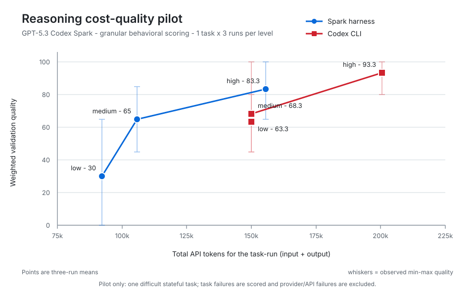

# Codex Spark Agent

An experimental Rust harness for running `gpt-5.3-codex-spark` as a local coding agent.

I built this because Spark is fast, but speed alone does not make a useful coding agent. The harness gives it a focused tool loop, normal chat sessions, repo skills, compaction, traces, and benchmarks that show where a run actually went wrong.

This is research software, not an official OpenAI or Codex project. It uses the ChatGPT/Codex backend shape observed in Codex-like clients, which can change.

## Quick start

Download the [latest release](https://github.com/ifBars/codex-spark-agent/releases/latest) for your platform:

| Platform | Archive |
| --- | --- |
| Windows x64 | `spark-<version>-windows-x64.zip` |
| Linux x64 | `spark-<version>-linux-x64.zip` |
| macOS Apple Silicon | `spark-<version>-macos-arm64.zip` |

Extract the archive, put `spark` on your `PATH`, then run:

```text
spark setup
spark chat
```

You need a ChatGPT account that can use Codex OAuth. Windows may ask you to unblock the downloaded archive before extraction.

Or run one task directly:

```text
spark chat "Inspect this repo and explain how commands are dispatched."
```

## What you get

- Interactive and one-shot coding sessions
- Native file, search, edit, command, and browser tools
- Repo-local skills and reusable prompt commands
- Stdio and HTTP MCP tool discovery
- SQLite-backed session history
- Remote-first compaction for long conversations
- Raw traces, diagnostics, and repeatable benchmark scenarios
- A read-only Spark explorer for native Codex

Spark is intentionally smaller than the official Codex CLI. I am not trying to replace Codex. This is a place to inspect and improve the parts that usually get hand-waved away: tool arguments, patch quality, command output, context pressure, recovery, and measurable task quality.

## Reasoning cost-quality pilot

<picture>
  <source media="(prefers-color-scheme: dark)" srcset="docs/assets/reasoning-cost-quality-pilot-dark.svg">
  
</picture>

This pilot ran one difficult stateful bugfix three times per runner and reasoning level, for 18 task-runs total. The points are three-run means and the whiskers show the observed quality range. Weighted behavioral checks expose partial progress that pass/fail scoring hides: Spark moves from 30 to 65 to 83.3 quality across low, medium, and high reasoning, while native Codex moves from 63.3 to 68.3 to 93.3. Task failures remain scored; only provider/API failures are excluded. It is useful as a scoring sanity check, not a broad performance claim.

The raw values are in [`docs/benchmarks/reasoning-cost-quality-pilot-2026-07-26.csv`](docs/benchmarks/reasoning-cost-quality-pilot-2026-07-26.csv). The earlier 144-run success-only chart remains in [`docs/assets/reasoning-cost-quality.svg`](docs/assets/reasoning-cost-quality.svg).

## Use Spark

Start an interactive session:

```powershell
spark chat
```

Run against another workspace:

```powershell
spark chat --cwd C:\path\to\repo "Find the config loader and trace its callers."
```

Inspect without allowing edits or command execution:

```powershell
spark chat --mode ask "Review the public API surface."
```

Save a trace and print a profile after the run:

```powershell
spark chat --trace --profile "Fix the failing test and explain the patch."
```

<details>
<summary><strong>More chat options</strong></summary>

Choose the reasoning effort:

```powershell
spark chat --reasoning-effort low "Answer briefly."
```

Append harness-specific system instructions:

```powershell
spark chat --system-prompt "Keep the review focused on runtime behavior." "Review this repo."
```

Resume a named session:

```powershell
spark chat --session refactor-tools
```

Run `spark chat --help` for the complete option list.

</details>

### Interactive chat

The commands I use most are:

- `/help` for the full command list
- `/status` for session and context pressure
- `/profile` for live profiler data
- `/compact` to compact the conversation
- `/session ...` to manage saved sessions
- `/skills` and `/skill load <name>` to manage skills
- `/commands` to list reusable prompts
- `/new`, `/save`, `/clear`, and `/exit` for session control

Up and Down move through submitted-command history while preserving the draft you were typing. PageUp, PageDown, and the mouse wheel scroll the transcript. Hover a message to copy it. Completed responses show elapsed time, token usage, average output speed, and time to first token when the API reports them.

## Use Spark as a Codex explorer

Spark can provide the read-only explorer behind native Codex while the parent task keeps its normal memory, plugins, skills, and workflow:

```text
spark setup --non-interactive --skip-login --skip-skill-migration --codex
```

Setup registers the persistent `spark_harness` MCP server and installs a native Codex explorer definition. New Codex tasks can then delegate bounded repository investigation to Spark and receive a compact evidence brief instead of a second full transcript.

If `spark_harness` or the explorer definition already exists, rerun setup with `--force-codex`. Existing files are backed up before replacement.

The MCP server can also be started directly:

```powershell
spark mcp-server
```

## Skills and prompt commands

Repo-local skills live at:

```text
.agents/skills/<name>/SKILL.md
```

Load one explicitly:

```powershell
spark chat --skill rust-patterns "Review src/tools.rs."
```

Spark also detects skill mentions such as `@rust-patterns` in the prompt. Compiled skill summaries are cached under `.spark/skills/` and rebuilt when the source changes.

Reusable prompt commands can live in:

```text
.agents/commands/<name>.md
.spark/commands/<name>.md
.claude/commands/<name>.md
```

List commands or preview an expansion:

```powershell
spark commands
spark commands review src/main.rs
```

Nested files become namespaced commands, so `.claude/commands/db/migrate.md` becomes `/db:migrate`. If the same command exists in more than one folder, `.agents` wins, then `.spark`, then `.claude`.

## MCP servers

Spark can use MCP servers from your global Codex config or the current repo's `.mcp.json` and `.spark/mcp.json`. Inside chat, use `/mcp` to list servers, change workspace overrides, or refresh tool discovery.

## Traces

Use traces when you need to know why a run felt clean or messy:

```powershell
spark chat --trace --profile "Fix the failing test."
spark traces --summary --limit 10
spark analyze-trace --timeline
```

The profiler tracks request size, token pressure, tool failures, repeated calls, command duration, compaction, and cache hits.

Benchmark workflows and profiler internals are documented in [Development and internals](docs/development.md).

## Setup and authentication

`spark setup` creates local app and session storage, runs device-code login, and can migrate existing skills into the current repo.

<details>
<summary><strong>Setup and login commands</strong></summary>

Run setup without prompts:

```powershell
spark setup --non-interactive
```

Useful flags:

- `--skip-login` creates local storage without signing in.
- `--skip-skill-migration` leaves `.agents/skills` untouched.
- `--skill-source C:\path\to\skills` selects a migration source.
- `--cwd C:\path\to\repo` selects the repo that receives skills.
- `--codex` installs the native Codex explorer integration.
- `--force-codex` replaces an existing integration after backing it up.

You can also run authentication separately:

```powershell
spark login
spark login --device
spark auth-status
```

Existing installs continue to use `~/.spark-codex/auth.json`. New installs use the platform app-data directory selected by the OS. Never commit auth files.

</details>

## Security

This project is not a sandbox.

- `cmd.exec` runs commands on your machine.
- Work mode can edit files inside the selected workspace.
- MCP servers may add tools with their own security boundaries.
- Traces can contain prompts, source, tool output, command output, and model responses.

Only run Spark in workspaces you trust. Keep `.spark-runs/`, `.spark-profile/`, `.spark/`, `.spark-codex/`, and `~/.spark-codex/` private.

## Development

Building from source, validation, transport details, profiling, and benchmark workflows are covered in [Development and internals](docs/development.md).

## License

[MIT](LICENSE)
