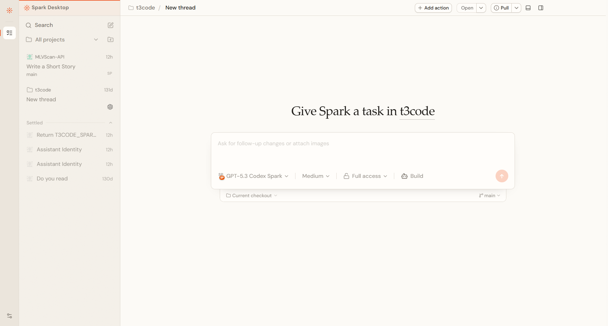
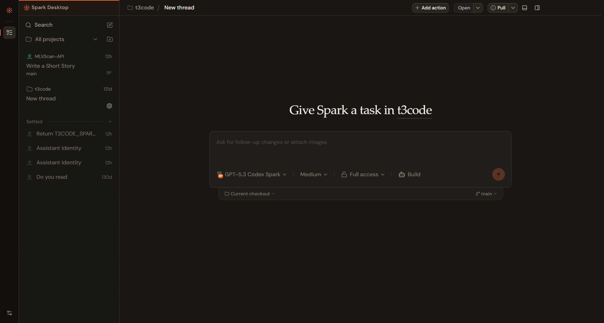

# Codex Spark Agent

A fast, experimental coding agent built around `gpt-5.3-codex-spark`.

<p align="center">
  
  
</p>

Spark combines a focused Rust agent loop with native coding tools, persistent chat sessions, skills, compaction, traces, and repeatable benchmarks. It is independent research software, not an official OpenAI project.

[Download Spark](https://github.com/ifBars/codex-spark-agent/releases/latest) · [Spark Desktop](https://github.com/ifBars/t3code/releases/latest) · [SparkBench](https://ifbars.github.io/codex-spark-agent/) · [Development docs](docs/development.md)

## Quick start

Download the latest release for Windows, Linux, or macOS, extract it, and put `spark` on your `PATH`.

```text
spark setup
spark chat
```

Spark uses ChatGPT/Codex OAuth. You can also run a single task directly:

```text
spark chat "Review this repository and suggest the highest-impact fix."
```

## What is included

- Interactive and one-shot coding sessions
- Native filesystem, shell, Git, web, and MCP tools
- Built-in Git/GitHub guidance, repo skills, and multi-agent workflows
- Trace inspection, usage history, and context compaction
- SparkBench for measured quality, cost, and latency comparisons

Run `spark --help` for the complete CLI. See the [development guide](docs/development.md) for source builds, tests, configuration, and architecture.

Git and GitHub requests automatically load the built-in GitHub workflow; it can also be selected with `--skill github`, `/skill github`, or an `@github` mention. The read-only `gh.read` tool uses the local GitHub CLI in both Ask and Work modes, while authorized mutations use `gh` through Work-mode command execution. The workflow preserves dirty worktrees, resolves the exact repository, and covers issues, pull requests, Actions, reviews, merges, and releases. A repo-local `.agents/skills/github/SKILL.md` can override the built-in policy.

## Spark Bench

[Spark Bench](https://ifbars.github.io/codex-spark-agent/) compares the Spark harness and native Codex CLI across one paired task matrix. The current sweep contains 144 attempts across 12 tasks, three reasoning levels, and two repeats.

Outcome quality comes from weighted task validators. Failed attempts remain in quality and pass-rate totals, while provider failures block publication. Failure recovery, repeated calls, tool-only streaks, and post-completion activity are reported separately as execution hygiene. Paired reports compute resource efficiency from duration, total input tokens, and tool calls, then quality-gate that result into the Benchmark Index.

[Review the current CSV](docs/benchmarks/reasoning-sweep-current-2026-08-09.csv) · [Read the benchmark summary](docs/benchmarks/reasoning-sweep-current-2026-08-09.md)

<details>
<summary>Benchmark reproducibility</summary>

List the quick benchmark slices before running them:

```powershell
.\scripts\quick_comparison_benchmark.ps1 -ListScenarios
.\scripts\quick_harness_benchmark.ps1 -ListScenarios
```

Comparison reports include a **Report Inputs** section with `benchmark_suite`, `benchmark_model`, `reasoning_effort`, `repeat`, `timeout_seconds`, `scenario_count`, `codex_bin`, `codex_command_path`, `codex_command_version`, `command_path`, `command_version`, and the complete `inputs` manifest. Controls include `codex_preflight_timeout_seconds`, `ignore_user_config`, `isolated_codex_home`, `allow_harness_request_failure_comparison`, `allow_codex_request_failure_comparison`, `skip_codex_preflight`, `preflight_only`, and `fail_on_directional_comparison`. Reports emit an **input freshness warning** when source rows no longer match those inputs. Use `--fail-on-directional-comparison` or the PowerShell `-FailOnDirectionalComparison` switch when directional evidence should fail the command.

Machine-readable status includes `scenarios`, `rerun_command`, `resume_command`, `retry_after_seconds`, `retry_at_local`, and `retry_at_utc`. A preflight-only run prints stable fields for automation:

```text
codex_preflight_status=...
codex_preflight_codex_path=...
codex_preflight_codex_version=...
codex_preflight_rerun_command=...
codex_preflight_resume_command=...
```

</details>

## Safety

Spark can edit files and run commands with your account's permissions. Use a clean worktree or disposable environment, and treat saved traces as sensitive.

## License

[MIT](LICENSE)
